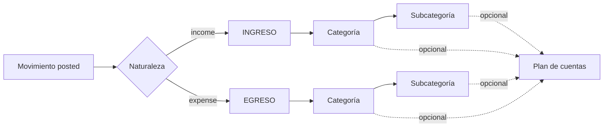

# 11F-8 — Modelo de clasificación operativa

## Principio

Una sola clasificación operativa diaria:



- **Naturaleza**: INGRESO | EGRESO (tipo del movimiento).
- **Categoría / Subcategoría**: árbol operativo (Gastos→Alimentación→Supermercado, etc.).
- **Ámbito**: Personal | Profesional — independiente; no se mezcla con categoría.
- **Plan de cuentas**: estructura patrimonial/financiera (activos/pasivos/patrimonio/resultados). **No** es una segunda copia del árbol cat/sub.

## Completo vs incompleto

| Estado | Criterio |
|--------|----------|
| Clasificado operativo | Tiene `category_id` (naturaleza ya está en `type`) |
| Pendiente | Ingreso/egreso posted sin categoría |
| Cuenta contable opcional | Cat/sub OK y `chart_account_id` null → **no** cuenta como incompleto |

## Nomenclatura aprobada

### EGRESO
- Alimentación → Supermercado, Comidas, Carnicería, …
- Servicios → utilities / streaming (**no** ingresos profesionales)
- Automotor → Combustible, Seguro, Mantenimiento, Patente, Estacionamiento, Peajes, … (solo auto-aplicar si descripción inequívoca)
- Gastos familiares → Miranda
- Muebles y útiles (MYU)

### INGRESO
- Ventas (clasificación económica; circuito comercial intacto)
- Servicios profesionales → Abonos, Remotos, Reparaciones, Instalaciones, …
- Financieros → Intereses, …

**Remotos** = INGRESO → Servicios profesionales → Remotos (nunca Servicios egreso).

## UX

- Cola: **Pendientes de clasificación** (solo sin `category_id`)
- Asignación cat/sub → plan: **Asignación al plan de cuentas**
- Reglas: **Reglas de clasificación automática** (0 activas OK)
- Bulk con vista previa; no sobrescribe clasificación manual confirmada
- Reportes: Nat/Cat/Sub/Ámbito + plan
- Dry-run 11F8: solo artisan/interno (fuera de la navegación)

## Dry-run (interno)

```bash
php artisan classification:dry-run-11f8 --export --json=exports/11f8/dry-run.json
```

No aplica reclasificación masiva hasta aprobación explícita. No aparece en el menú de usuario.
